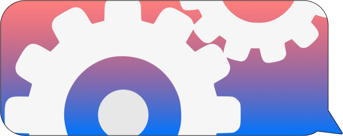

# AutoText 


## Setup

### Install:


```
$ node
```
```
$ yarn
```

### Dependencies:

To install dependencies run: 
```
yarn
``` 

Or manually add them:

```
$ yarn add vcard-json
$ yarn add shelljs
$ yarn
```


Make sure you also have `node` to run javascript in the commandline.


## Getting Contacts File:


1) Go to your contacts app, and select the contacts you want to send your message to. 

2) You can skip ordering and select multiple with the "command" key

3) Then, select File > Export vCard, and save it to the same directory with the autotext script (.sh) and sendMessage js with it.

Now, once you have your contacts.vcf in your working directory, run:

```
node sendMessage.js
```

You'll see some stuff printed in the command line, but more importantly, you'll see your messages sent on iMessage!

## Send the Message

Currently, the message is just hardcoded into the .js file as `MESSAGE`. You can edit it directly. It will replace `UNIQUE_CONTACT` with the contact's first word in their name.

# Issues:

- make it more user friendly
- add ability for phone numbers not just contacts names
- perhaps read message from text file
- add more "commands" where message could be even more personalized dependending on what contact it is.

## Troubleshooting:

- ensure iMessage is open

## Acknowledgements:

Awesome vcf reader by Andrew Pace:
https://github.com/andrewppace/vcard-json

